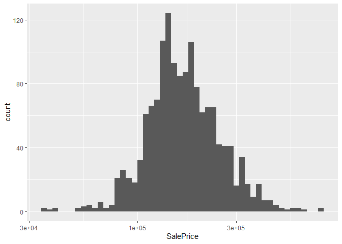

# Ames-Housing
Nusa Seldi

## Introduction

Hello! Today we will try to participate in another kaggle Getting
Started competitions. The challenge in this competition is to predict
the final price of each house using the data provided. For this
competition, we will build a multilayer perceptron model to complete the
challenge. We also gonna tune the parameters to optimize our model.

## Import Library

<details class="code-fold">
<summary>Code</summary>

``` r
pacman::p_load(
tidyverse,
tidymodels,
skimr
)
```

</details>

## Load and inspect the data

There are 1460 observation and 81 variables for training dataset also
1459 observation and 80 variables for test dataset that we got from
kaggle. For training dataset consist of 43 categorical data and 38
numeric data.

<details class="code-fold">
<summary>Code</summary>

``` r
  ames_train <- read_csv("train.csv")
  ames_test <- read_csv("test.csv")
  
  dim(ames_train)
```

</details>

    [1] 1460   81

<details class="code-fold">
<summary>Code</summary>

``` r
  glimpse(ames_train)
```

</details>

    Rows: 1,460
    Columns: 81
    $ Id            <dbl> 1, 2, 3, 4, 5, 6, 7, 8, 9, 10, 11, 12, 13, 14, 15, 16, 1…
    $ MSSubClass    <dbl> 60, 20, 60, 70, 60, 50, 20, 60, 50, 190, 20, 60, 20, 20,…
    $ MSZoning      <chr> "RL", "RL", "RL", "RL", "RL", "RL", "RL", "RL", "RM", "R…
    $ LotFrontage   <dbl> 65, 80, 68, 60, 84, 85, 75, NA, 51, 50, 70, 85, NA, 91, …
    $ LotArea       <dbl> 8450, 9600, 11250, 9550, 14260, 14115, 10084, 10382, 612…
    $ Street        <chr> "Pave", "Pave", "Pave", "Pave", "Pave", "Pave", "Pave", …
    $ Alley         <chr> NA, NA, NA, NA, NA, NA, NA, NA, NA, NA, NA, NA, NA, NA, …
    $ LotShape      <chr> "Reg", "Reg", "IR1", "IR1", "IR1", "IR1", "Reg", "IR1", …
    $ LandContour   <chr> "Lvl", "Lvl", "Lvl", "Lvl", "Lvl", "Lvl", "Lvl", "Lvl", …
    $ Utilities     <chr> "AllPub", "AllPub", "AllPub", "AllPub", "AllPub", "AllPu…
    $ LotConfig     <chr> "Inside", "FR2", "Inside", "Corner", "FR2", "Inside", "I…
    $ LandSlope     <chr> "Gtl", "Gtl", "Gtl", "Gtl", "Gtl", "Gtl", "Gtl", "Gtl", …
    $ Neighborhood  <chr> "CollgCr", "Veenker", "CollgCr", "Crawfor", "NoRidge", "…
    $ Condition1    <chr> "Norm", "Feedr", "Norm", "Norm", "Norm", "Norm", "Norm",…
    $ Condition2    <chr> "Norm", "Norm", "Norm", "Norm", "Norm", "Norm", "Norm", …
    $ BldgType      <chr> "1Fam", "1Fam", "1Fam", "1Fam", "1Fam", "1Fam", "1Fam", …
    $ HouseStyle    <chr> "2Story", "1Story", "2Story", "2Story", "2Story", "1.5Fi…
    $ OverallQual   <dbl> 7, 6, 7, 7, 8, 5, 8, 7, 7, 5, 5, 9, 5, 7, 6, 7, 6, 4, 5,…
    $ OverallCond   <dbl> 5, 8, 5, 5, 5, 5, 5, 6, 5, 6, 5, 5, 6, 5, 5, 8, 7, 5, 5,…
    $ YearBuilt     <dbl> 2003, 1976, 2001, 1915, 2000, 1993, 2004, 1973, 1931, 19…
    $ YearRemodAdd  <dbl> 2003, 1976, 2002, 1970, 2000, 1995, 2005, 1973, 1950, 19…
    $ RoofStyle     <chr> "Gable", "Gable", "Gable", "Gable", "Gable", "Gable", "G…
    $ RoofMatl      <chr> "CompShg", "CompShg", "CompShg", "CompShg", "CompShg", "…
    $ Exterior1st   <chr> "VinylSd", "MetalSd", "VinylSd", "Wd Sdng", "VinylSd", "…
    $ Exterior2nd   <chr> "VinylSd", "MetalSd", "VinylSd", "Wd Shng", "VinylSd", "…
    $ MasVnrType    <chr> "BrkFace", "None", "BrkFace", "None", "BrkFace", "None",…
    $ MasVnrArea    <dbl> 196, 0, 162, 0, 350, 0, 186, 240, 0, 0, 0, 286, 0, 306, …
    $ ExterQual     <chr> "Gd", "TA", "Gd", "TA", "Gd", "TA", "Gd", "TA", "TA", "T…
    $ ExterCond     <chr> "TA", "TA", "TA", "TA", "TA", "TA", "TA", "TA", "TA", "T…
    $ Foundation    <chr> "PConc", "CBlock", "PConc", "BrkTil", "PConc", "Wood", "…
    $ BsmtQual      <chr> "Gd", "Gd", "Gd", "TA", "Gd", "Gd", "Ex", "Gd", "TA", "T…
    $ BsmtCond      <chr> "TA", "TA", "TA", "Gd", "TA", "TA", "TA", "TA", "TA", "T…
    $ BsmtExposure  <chr> "No", "Gd", "Mn", "No", "Av", "No", "Av", "Mn", "No", "N…
    $ BsmtFinType1  <chr> "GLQ", "ALQ", "GLQ", "ALQ", "GLQ", "GLQ", "GLQ", "ALQ", …
    $ BsmtFinSF1    <dbl> 706, 978, 486, 216, 655, 732, 1369, 859, 0, 851, 906, 99…
    $ BsmtFinType2  <chr> "Unf", "Unf", "Unf", "Unf", "Unf", "Unf", "Unf", "BLQ", …
    $ BsmtFinSF2    <dbl> 0, 0, 0, 0, 0, 0, 0, 32, 0, 0, 0, 0, 0, 0, 0, 0, 0, 0, 0…
    $ BsmtUnfSF     <dbl> 150, 284, 434, 540, 490, 64, 317, 216, 952, 140, 134, 17…
    $ TotalBsmtSF   <dbl> 856, 1262, 920, 756, 1145, 796, 1686, 1107, 952, 991, 10…
    $ Heating       <chr> "GasA", "GasA", "GasA", "GasA", "GasA", "GasA", "GasA", …
    $ HeatingQC     <chr> "Ex", "Ex", "Ex", "Gd", "Ex", "Ex", "Ex", "Ex", "Gd", "E…
    $ CentralAir    <chr> "Y", "Y", "Y", "Y", "Y", "Y", "Y", "Y", "Y", "Y", "Y", "…
    $ Electrical    <chr> "SBrkr", "SBrkr", "SBrkr", "SBrkr", "SBrkr", "SBrkr", "S…
    $ `1stFlrSF`    <dbl> 856, 1262, 920, 961, 1145, 796, 1694, 1107, 1022, 1077, …
    $ `2ndFlrSF`    <dbl> 854, 0, 866, 756, 1053, 566, 0, 983, 752, 0, 0, 1142, 0,…
    $ LowQualFinSF  <dbl> 0, 0, 0, 0, 0, 0, 0, 0, 0, 0, 0, 0, 0, 0, 0, 0, 0, 0, 0,…
    $ GrLivArea     <dbl> 1710, 1262, 1786, 1717, 2198, 1362, 1694, 2090, 1774, 10…
    $ BsmtFullBath  <dbl> 1, 0, 1, 1, 1, 1, 1, 1, 0, 1, 1, 1, 1, 0, 1, 0, 1, 0, 1,…
    $ BsmtHalfBath  <dbl> 0, 1, 0, 0, 0, 0, 0, 0, 0, 0, 0, 0, 0, 0, 0, 0, 0, 0, 0,…
    $ FullBath      <dbl> 2, 2, 2, 1, 2, 1, 2, 2, 2, 1, 1, 3, 1, 2, 1, 1, 1, 2, 1,…
    $ HalfBath      <dbl> 1, 0, 1, 0, 1, 1, 0, 1, 0, 0, 0, 0, 0, 0, 1, 0, 0, 0, 1,…
    $ BedroomAbvGr  <dbl> 3, 3, 3, 3, 4, 1, 3, 3, 2, 2, 3, 4, 2, 3, 2, 2, 2, 2, 3,…
    $ KitchenAbvGr  <dbl> 1, 1, 1, 1, 1, 1, 1, 1, 2, 2, 1, 1, 1, 1, 1, 1, 1, 2, 1,…
    $ KitchenQual   <chr> "Gd", "TA", "Gd", "Gd", "Gd", "TA", "Gd", "TA", "TA", "T…
    $ TotRmsAbvGrd  <dbl> 8, 6, 6, 7, 9, 5, 7, 7, 8, 5, 5, 11, 4, 7, 5, 5, 5, 6, 6…
    $ Functional    <chr> "Typ", "Typ", "Typ", "Typ", "Typ", "Typ", "Typ", "Typ", …
    $ Fireplaces    <dbl> 0, 1, 1, 1, 1, 0, 1, 2, 2, 2, 0, 2, 0, 1, 1, 0, 1, 0, 0,…
    $ FireplaceQu   <chr> NA, "TA", "TA", "Gd", "TA", NA, "Gd", "TA", "TA", "TA", …
    $ GarageType    <chr> "Attchd", "Attchd", "Attchd", "Detchd", "Attchd", "Attch…
    $ GarageYrBlt   <dbl> 2003, 1976, 2001, 1998, 2000, 1993, 2004, 1973, 1931, 19…
    $ GarageFinish  <chr> "RFn", "RFn", "RFn", "Unf", "RFn", "Unf", "RFn", "RFn", …
    $ GarageCars    <dbl> 2, 2, 2, 3, 3, 2, 2, 2, 2, 1, 1, 3, 1, 3, 1, 2, 2, 2, 2,…
    $ GarageArea    <dbl> 548, 460, 608, 642, 836, 480, 636, 484, 468, 205, 384, 7…
    $ GarageQual    <chr> "TA", "TA", "TA", "TA", "TA", "TA", "TA", "TA", "Fa", "G…
    $ GarageCond    <chr> "TA", "TA", "TA", "TA", "TA", "TA", "TA", "TA", "TA", "T…
    $ PavedDrive    <chr> "Y", "Y", "Y", "Y", "Y", "Y", "Y", "Y", "Y", "Y", "Y", "…
    $ WoodDeckSF    <dbl> 0, 298, 0, 0, 192, 40, 255, 235, 90, 0, 0, 147, 140, 160…
    $ OpenPorchSF   <dbl> 61, 0, 42, 35, 84, 30, 57, 204, 0, 4, 0, 21, 0, 33, 213,…
    $ EnclosedPorch <dbl> 0, 0, 0, 272, 0, 0, 0, 228, 205, 0, 0, 0, 0, 0, 176, 0, …
    $ `3SsnPorch`   <dbl> 0, 0, 0, 0, 0, 320, 0, 0, 0, 0, 0, 0, 0, 0, 0, 0, 0, 0, …
    $ ScreenPorch   <dbl> 0, 0, 0, 0, 0, 0, 0, 0, 0, 0, 0, 0, 176, 0, 0, 0, 0, 0, …
    $ PoolArea      <dbl> 0, 0, 0, 0, 0, 0, 0, 0, 0, 0, 0, 0, 0, 0, 0, 0, 0, 0, 0,…
    $ PoolQC        <chr> NA, NA, NA, NA, NA, NA, NA, NA, NA, NA, NA, NA, NA, NA, …
    $ Fence         <chr> NA, NA, NA, NA, NA, "MnPrv", NA, NA, NA, NA, NA, NA, NA,…
    $ MiscFeature   <chr> NA, NA, NA, NA, NA, "Shed", NA, "Shed", NA, NA, NA, NA, …
    $ MiscVal       <dbl> 0, 0, 0, 0, 0, 700, 0, 350, 0, 0, 0, 0, 0, 0, 0, 0, 700,…
    $ MoSold        <dbl> 2, 5, 9, 2, 12, 10, 8, 11, 4, 1, 2, 7, 9, 8, 5, 7, 3, 10…
    $ YrSold        <dbl> 2008, 2007, 2008, 2006, 2008, 2009, 2007, 2009, 2008, 20…
    $ SaleType      <chr> "WD", "WD", "WD", "WD", "WD", "WD", "WD", "WD", "WD", "W…
    $ SaleCondition <chr> "Normal", "Normal", "Normal", "Abnorml", "Normal", "Norm…
    $ SalePrice     <dbl> 208500, 181500, 223500, 140000, 250000, 143000, 307000, …

<details class="code-fold">
<summary>Code</summary>

``` r
  skim(ames_train)
```

</details>

|                                                  |            |
|:-------------------------------------------------|:-----------|
| Name                                             | ames_train |
| Number of rows                                   | 1460       |
| Number of columns                                | 81         |
| \_\_\_\_\_\_\_\_\_\_\_\_\_\_\_\_\_\_\_\_\_\_\_   |            |
| Column type frequency:                           |            |
| character                                        | 43         |
| numeric                                          | 38         |
| \_\_\_\_\_\_\_\_\_\_\_\_\_\_\_\_\_\_\_\_\_\_\_\_ |            |
| Group variables                                  | None       |

Data summary

**Variable type: character**

| skim_variable | n_missing | complete_rate | min | max | empty | n_unique | whitespace |
|:--------------|----------:|--------------:|----:|----:|------:|---------:|-----------:|
| MSZoning      |         0 |          1.00 |   2 |   7 |     0 |        5 |          0 |
| Street        |         0 |          1.00 |   4 |   4 |     0 |        2 |          0 |
| Alley         |      1369 |          0.06 |   4 |   4 |     0 |        2 |          0 |
| LotShape      |         0 |          1.00 |   3 |   3 |     0 |        4 |          0 |
| LandContour   |         0 |          1.00 |   3 |   3 |     0 |        4 |          0 |
| Utilities     |         0 |          1.00 |   6 |   6 |     0 |        2 |          0 |
| LotConfig     |         0 |          1.00 |   3 |   7 |     0 |        5 |          0 |
| LandSlope     |         0 |          1.00 |   3 |   3 |     0 |        3 |          0 |
| Neighborhood  |         0 |          1.00 |   5 |   7 |     0 |       25 |          0 |
| Condition1    |         0 |          1.00 |   4 |   6 |     0 |        9 |          0 |
| Condition2    |         0 |          1.00 |   4 |   6 |     0 |        8 |          0 |
| BldgType      |         0 |          1.00 |   4 |   6 |     0 |        5 |          0 |
| HouseStyle    |         0 |          1.00 |   4 |   6 |     0 |        8 |          0 |
| RoofStyle     |         0 |          1.00 |   3 |   7 |     0 |        6 |          0 |
| RoofMatl      |         0 |          1.00 |   4 |   7 |     0 |        8 |          0 |
| Exterior1st   |         0 |          1.00 |   5 |   7 |     0 |       15 |          0 |
| Exterior2nd   |         0 |          1.00 |   5 |   7 |     0 |       16 |          0 |
| MasVnrType    |         8 |          0.99 |   4 |   7 |     0 |        4 |          0 |
| ExterQual     |         0 |          1.00 |   2 |   2 |     0 |        4 |          0 |
| ExterCond     |         0 |          1.00 |   2 |   2 |     0 |        5 |          0 |
| Foundation    |         0 |          1.00 |   4 |   6 |     0 |        6 |          0 |
| BsmtQual      |        37 |          0.97 |   2 |   2 |     0 |        4 |          0 |
| BsmtCond      |        37 |          0.97 |   2 |   2 |     0 |        4 |          0 |
| BsmtExposure  |        38 |          0.97 |   2 |   2 |     0 |        4 |          0 |
| BsmtFinType1  |        37 |          0.97 |   3 |   3 |     0 |        6 |          0 |
| BsmtFinType2  |        38 |          0.97 |   3 |   3 |     0 |        6 |          0 |
| Heating       |         0 |          1.00 |   4 |   5 |     0 |        6 |          0 |
| HeatingQC     |         0 |          1.00 |   2 |   2 |     0 |        5 |          0 |
| CentralAir    |         0 |          1.00 |   1 |   1 |     0 |        2 |          0 |
| Electrical    |         1 |          1.00 |   3 |   5 |     0 |        5 |          0 |
| KitchenQual   |         0 |          1.00 |   2 |   2 |     0 |        4 |          0 |
| Functional    |         0 |          1.00 |   3 |   4 |     0 |        7 |          0 |
| FireplaceQu   |       690 |          0.53 |   2 |   2 |     0 |        5 |          0 |
| GarageType    |        81 |          0.94 |   6 |   7 |     0 |        6 |          0 |
| GarageFinish  |        81 |          0.94 |   3 |   3 |     0 |        3 |          0 |
| GarageQual    |        81 |          0.94 |   2 |   2 |     0 |        5 |          0 |
| GarageCond    |        81 |          0.94 |   2 |   2 |     0 |        5 |          0 |
| PavedDrive    |         0 |          1.00 |   1 |   1 |     0 |        3 |          0 |
| PoolQC        |      1453 |          0.00 |   2 |   2 |     0 |        3 |          0 |
| Fence         |      1179 |          0.19 |   4 |   5 |     0 |        4 |          0 |
| MiscFeature   |      1406 |          0.04 |   4 |   4 |     0 |        4 |          0 |
| SaleType      |         0 |          1.00 |   2 |   5 |     0 |        9 |          0 |
| SaleCondition |         0 |          1.00 |   6 |   7 |     0 |        6 |          0 |

**Variable type: numeric**

| skim_variable | n_missing | complete_rate |      mean |       sd |    p0 |       p25 |      p50 |       p75 |   p100 | hist  |
|:--------------|----------:|--------------:|----------:|---------:|------:|----------:|---------:|----------:|-------:|:------|
| Id            |         0 |          1.00 |    730.50 |   421.61 |     1 |    365.75 |    730.5 |   1095.25 |   1460 | ▇▇▇▇▇ |
| MSSubClass    |         0 |          1.00 |     56.90 |    42.30 |    20 |     20.00 |     50.0 |     70.00 |    190 | ▇▅▂▁▁ |
| LotFrontage   |       259 |          0.82 |     70.05 |    24.28 |    21 |     59.00 |     69.0 |     80.00 |    313 | ▇▃▁▁▁ |
| LotArea       |         0 |          1.00 |  10516.83 |  9981.26 |  1300 |   7553.50 |   9478.5 |  11601.50 | 215245 | ▇▁▁▁▁ |
| OverallQual   |         0 |          1.00 |      6.10 |     1.38 |     1 |      5.00 |      6.0 |      7.00 |     10 | ▁▂▇▅▁ |
| OverallCond   |         0 |          1.00 |      5.58 |     1.11 |     1 |      5.00 |      5.0 |      6.00 |      9 | ▁▁▇▅▁ |
| YearBuilt     |         0 |          1.00 |   1971.27 |    30.20 |  1872 |   1954.00 |   1973.0 |   2000.00 |   2010 | ▁▂▃▆▇ |
| YearRemodAdd  |         0 |          1.00 |   1984.87 |    20.65 |  1950 |   1967.00 |   1994.0 |   2004.00 |   2010 | ▅▂▂▃▇ |
| MasVnrArea    |         8 |          0.99 |    103.69 |   181.07 |     0 |      0.00 |      0.0 |    166.00 |   1600 | ▇▁▁▁▁ |
| BsmtFinSF1    |         0 |          1.00 |    443.64 |   456.10 |     0 |      0.00 |    383.5 |    712.25 |   5644 | ▇▁▁▁▁ |
| BsmtFinSF2    |         0 |          1.00 |     46.55 |   161.32 |     0 |      0.00 |      0.0 |      0.00 |   1474 | ▇▁▁▁▁ |
| BsmtUnfSF     |         0 |          1.00 |    567.24 |   441.87 |     0 |    223.00 |    477.5 |    808.00 |   2336 | ▇▅▂▁▁ |
| TotalBsmtSF   |         0 |          1.00 |   1057.43 |   438.71 |     0 |    795.75 |    991.5 |   1298.25 |   6110 | ▇▃▁▁▁ |
| 1stFlrSF      |         0 |          1.00 |   1162.63 |   386.59 |   334 |    882.00 |   1087.0 |   1391.25 |   4692 | ▇▅▁▁▁ |
| 2ndFlrSF      |         0 |          1.00 |    346.99 |   436.53 |     0 |      0.00 |      0.0 |    728.00 |   2065 | ▇▃▂▁▁ |
| LowQualFinSF  |         0 |          1.00 |      5.84 |    48.62 |     0 |      0.00 |      0.0 |      0.00 |    572 | ▇▁▁▁▁ |
| GrLivArea     |         0 |          1.00 |   1515.46 |   525.48 |   334 |   1129.50 |   1464.0 |   1776.75 |   5642 | ▇▇▁▁▁ |
| BsmtFullBath  |         0 |          1.00 |      0.43 |     0.52 |     0 |      0.00 |      0.0 |      1.00 |      3 | ▇▆▁▁▁ |
| BsmtHalfBath  |         0 |          1.00 |      0.06 |     0.24 |     0 |      0.00 |      0.0 |      0.00 |      2 | ▇▁▁▁▁ |
| FullBath      |         0 |          1.00 |      1.57 |     0.55 |     0 |      1.00 |      2.0 |      2.00 |      3 | ▁▇▁▇▁ |
| HalfBath      |         0 |          1.00 |      0.38 |     0.50 |     0 |      0.00 |      0.0 |      1.00 |      2 | ▇▁▅▁▁ |
| BedroomAbvGr  |         0 |          1.00 |      2.87 |     0.82 |     0 |      2.00 |      3.0 |      3.00 |      8 | ▁▇▂▁▁ |
| KitchenAbvGr  |         0 |          1.00 |      1.05 |     0.22 |     0 |      1.00 |      1.0 |      1.00 |      3 | ▁▇▁▁▁ |
| TotRmsAbvGrd  |         0 |          1.00 |      6.52 |     1.63 |     2 |      5.00 |      6.0 |      7.00 |     14 | ▂▇▇▁▁ |
| Fireplaces    |         0 |          1.00 |      0.61 |     0.64 |     0 |      0.00 |      1.0 |      1.00 |      3 | ▇▇▁▁▁ |
| GarageYrBlt   |        81 |          0.94 |   1978.51 |    24.69 |  1900 |   1961.00 |   1980.0 |   2002.00 |   2010 | ▁▁▅▅▇ |
| GarageCars    |         0 |          1.00 |      1.77 |     0.75 |     0 |      1.00 |      2.0 |      2.00 |      4 | ▁▃▇▂▁ |
| GarageArea    |         0 |          1.00 |    472.98 |   213.80 |     0 |    334.50 |    480.0 |    576.00 |   1418 | ▂▇▃▁▁ |
| WoodDeckSF    |         0 |          1.00 |     94.24 |   125.34 |     0 |      0.00 |      0.0 |    168.00 |    857 | ▇▂▁▁▁ |
| OpenPorchSF   |         0 |          1.00 |     46.66 |    66.26 |     0 |      0.00 |     25.0 |     68.00 |    547 | ▇▁▁▁▁ |
| EnclosedPorch |         0 |          1.00 |     21.95 |    61.12 |     0 |      0.00 |      0.0 |      0.00 |    552 | ▇▁▁▁▁ |
| 3SsnPorch     |         0 |          1.00 |      3.41 |    29.32 |     0 |      0.00 |      0.0 |      0.00 |    508 | ▇▁▁▁▁ |
| ScreenPorch   |         0 |          1.00 |     15.06 |    55.76 |     0 |      0.00 |      0.0 |      0.00 |    480 | ▇▁▁▁▁ |
| PoolArea      |         0 |          1.00 |      2.76 |    40.18 |     0 |      0.00 |      0.0 |      0.00 |    738 | ▇▁▁▁▁ |
| MiscVal       |         0 |          1.00 |     43.49 |   496.12 |     0 |      0.00 |      0.0 |      0.00 |  15500 | ▇▁▁▁▁ |
| MoSold        |         0 |          1.00 |      6.32 |     2.70 |     1 |      5.00 |      6.0 |      8.00 |     12 | ▃▆▇▃▃ |
| YrSold        |         0 |          1.00 |   2007.82 |     1.33 |  2006 |   2007.00 |   2008.0 |   2009.00 |   2010 | ▇▇▇▇▅ |
| SalePrice     |         0 |          1.00 | 180921.20 | 79442.50 | 34900 | 129975.00 | 163000.0 | 214000.00 | 755000 | ▇▅▁▁▁ |

## Data Transformation

After we inspect and match with the data description, some columns with
missing data actually not really have missing data. For example with the
column “Fence”, the value “na” in this column does not mean that the
value does not exist but it means that there is no “fence” in the house
so we can replace the value “na” with “no”.

<details class="code-fold">
<summary>Code</summary>

``` r
ames_train <- ames_train |>
  mutate(across(starts_with("Bsmt"), ~ replace_na(., "No")))

ames_train <- ames_train |>
  rename(GrgYrBlt = GarageYrBlt) |>
  mutate(across(starts_with("Garage"), ~ replace_na(., "No"))) |>
  rename(GarageYrBlt = GrgYrBlt)

ames_train <- ames_train |>
  mutate(across(c(Alley, FireplaceQu, PoolQC, Fence, MiscFeature, MasVnrType), ~ replace_na(., "No")))

ames_train <- ames_train |>
  mutate(MasVnrArea = replace_na(MasVnrArea, 0))

ames_train <- ames_train |>
  mutate(across(where(is.character), as.factor))
```

</details>

## Explore the data

<details class="code-fold">
<summary>Code</summary>

``` r
 ggplot(data = ames_train) +
  geom_histogram(aes(x = SalePrice), bins = 50) +
  scale_x_log10() 
```

</details>



<details class="code-fold">
<summary>Code</summary>

``` r
ggplot(data = ames_train) +
  geom_bar(aes(x = OverallCond))
```

</details>


## Build a model

<details class="code-fold">
<summary>Code</summary>

``` r
set.seed(123)
house_split <- initial_split(ames_train)
house_train <- training(house_split)
house_test <- testing(house_split)

set.seed(88)
house_fold <- vfold_cv(ames_train, v = 10, repeats = 1)
```

</details>

This time, because there are so many features in the dataset, we will
try dimensionality reduction using principal component analysis (PCA)
and independent component analysis (ICA). We will make three recipes
which are basic recipe, pca recipe, and ica recipe.

<details class="code-fold">
<summary>Code</summary>

``` r
basic_recipe <- recipe(SalePrice ~ . , data = house_train) |> 
  update_role(Id, new_role = "id") |> 
  step_impute_knn(all_predictors()) |> 
  step_zv(all_predictors()) |> 
  step_normalize(all_numeric_predictors()) |> 
  step_corr(all_numeric_predictors(), threshold = 0.95) |> 
  step_dummy(all_nominal_predictors()) 

pca_recipe <- recipe(SalePrice ~ . , data = house_train) |>
  update_role(Id, new_role = "id") |> 
  step_impute_knn(all_predictors()) |> 
  step_zv(all_predictors()) |> 
  step_normalize(all_numeric_predictors()) |> 
  step_corr(all_numeric_predictors(), threshold = 0.95) |> 
  step_dummy(all_nominal_predictors()) |> 
  step_pca(all_predictors(), num_comp = 8) 

prep_pca <- prep(pca_recipe) 
 
baked_pca <- bake(prep_pca, new_data = NULL)

head(baked_pca)
```

</details>

    # A tibble: 6 × 10
         Id SalePrice   PC1   PC2    PC3    PC4     PC5    PC6     PC7    PC8
      <dbl>     <dbl> <dbl> <dbl>  <dbl>  <dbl>   <dbl>  <dbl>   <dbl>  <dbl>
    1   415    228000  5.10  2.91  2.06  -0.739  1.12   -2.31   0.0254  2.18 
    2   463     62383  5.01 -3.62 -0.619  1.32  -0.0369 -0.529 -0.365   0.195
    3   179    501837  4.53  6.36 -3.42   1.87  -0.109   1.67  -0.0897  0.258
    4   526    176000  5.29  1.56 -0.638 -2.27  -2.39   -0.718 -0.982   0.366
    5   195    127000  5.21 -3.13 -1.16  -0.152 -0.613  -0.452  0.700  -0.614
    6   938    253000  5.44  2.83  1.13  -1.93   0.318  -0.463  0.339  -1.20 

<details class="code-fold">
<summary>Code</summary>

``` r
ica_recipe <- recipe(SalePrice ~ . , data = house_train) |>
  update_role(Id, new_role = "id") |> 
  step_impute_knn(all_predictors()) |> 
  step_zv(all_predictors()) |> 
  step_normalize(all_numeric_predictors()) |> 
  step_corr(all_numeric_predictors(), threshold = 0.95) |> 
  step_dummy(all_nominal_predictors()) |> 
  step_ica(all_predictors() , num_comp = 8)

prep_ica <- prep(ica_recipe) 

baked_ica <- bake(prep_ica, new_data = NULL)

head(baked_ica)
```

</details>

    # A tibble: 6 × 10
         Id SalePrice     IC1    IC2    IC3    IC4    IC5    IC6    IC7    IC8
      <dbl>     <dbl>   <dbl>  <dbl>  <dbl>  <dbl>  <dbl>  <dbl>  <dbl>  <dbl>
    1   415    228000  0.0347  2.63   0.730  0.667  0.428  1.54   1.10  -0.971
    2   463     62383 -0.193   0.606  0.316  0.352 -0.348 -0.485 -0.133  1.24 
    3   179    501837 -0.536  -1.50  -2.74  -0.147  0.961 -1.80   1.07  -1.15 
    4   526    176000  0.964   0.181  1.41   0.323 -0.497 -0.851  0.586 -1.34 
    5   195    127000  0.367  -0.516  0.556  0.508  0.439 -0.497 -0.623  0.905
    6   938    253000  0.684  -0.138  0.266  0.367 -0.134  1.11  -0.884 -1.30 

<details class="code-fold">
<summary>Code</summary>

``` r
baked_pca |> 
  ggplot(aes(x = PC1, y = PC2)) +
  geom_point()
```

</details>


<details class="code-fold">
<summary>Code</summary>

``` r
baked_ica |> 
  ggplot(aes(x = IC1, y = IC2)) +
  geom_point()
```

</details>


For the model, we will build a single layer neural network and we also
gonna tune the paramater for hidden units, penalty, epochs, and learn
rate.

<details class="code-fold">
<summary>Code</summary>

``` r
doParallel::registerDoParallel()
mlp_model <- mlp(hidden_units = tune(), penalty = tune(), epochs = tune(), learn_rate = tune()) |> 
  set_mode("regression") |> 
  set_engine("brulee")

house_wf <- workflow_set(preproc = list(pca = pca_recipe, ica = ica_recipe, basic = basic_recipe), models = list(mlp_model))

house_res <- workflow_map(house_wf, 
                          resamples = house_fold,
                          seed = 999,
                          grid = 5, 
                          control = control_grid(parallel_over = "everything", save_pred = TRUE))
```

</details>

## Evaluate the model

<details class="code-fold">
<summary>Code</summary>

``` r
collect_metrics(house_res) 
```

</details>

    # A tibble: 30 × 9
       wflow_id .config       preproc model .metric .estimator    mean     n std_err
       <chr>    <chr>         <chr>   <chr> <chr>   <chr>        <dbl> <int>   <dbl>
     1 pca_mlp  Preprocessor… recipe  mlp   rmse    standard   5.30e+4    10 6.80e+3
     2 pca_mlp  Preprocessor… recipe  mlp   rsq     standard   6.24e-1     9 8.42e-2
     3 pca_mlp  Preprocessor… recipe  mlp   rmse    standard   3.80e+4    10 5.30e+3
     4 pca_mlp  Preprocessor… recipe  mlp   rsq     standard   7.74e-1    10 5.34e-2
     5 pca_mlp  Preprocessor… recipe  mlp   rmse    standard   3.44e+4    10 2.91e+3
     6 pca_mlp  Preprocessor… recipe  mlp   rsq     standard   8.19e-1    10 2.74e-2
     7 pca_mlp  Preprocessor… recipe  mlp   rmse    standard   4.30e+4    10 6.56e+3
     8 pca_mlp  Preprocessor… recipe  mlp   rsq     standard   7.38e-1    10 6.23e-2
     9 pca_mlp  Preprocessor… recipe  mlp   rmse    standard   3.58e+4    10 4.20e+3
    10 pca_mlp  Preprocessor… recipe  mlp   rsq     standard   8.04e-1    10 4.03e-2
    # ℹ 20 more rows

<details class="code-fold">
<summary>Code</summary>

``` r
house_res |> 
  rank_results() |> 
  filter(.metric == 'rmse')
```

</details>

    # A tibble: 15 × 9
       wflow_id  .config       .metric   mean std_err     n preprocessor model  rank
       <chr>     <chr>         <chr>    <dbl>   <dbl> <int> <chr>        <chr> <int>
     1 basic_mlp Preprocessor… rmse    3.27e4   4357.    10 recipe       mlp       1
     2 basic_mlp Preprocessor… rmse    3.40e4   4144.    10 recipe       mlp       2
     3 pca_mlp   Preprocessor… rmse    3.44e4   2913.    10 recipe       mlp       3
     4 basic_mlp Preprocessor… rmse    3.54e4   4326.    10 recipe       mlp       4
     5 pca_mlp   Preprocessor… rmse    3.58e4   4203.    10 recipe       mlp       5
     6 basic_mlp Preprocessor… rmse    3.59e4   3304.    10 recipe       mlp       6
     7 pca_mlp   Preprocessor… rmse    3.80e4   5301.    10 recipe       mlp       7
     8 ica_mlp   Preprocessor… rmse    3.81e4   4187.    10 recipe       mlp       8
     9 ica_mlp   Preprocessor… rmse    3.85e4   4645.    10 recipe       mlp       9
    10 ica_mlp   Preprocessor… rmse    3.88e4   2964.    10 recipe       mlp      10
    11 basic_mlp Preprocessor… rmse    3.92e4   6176.    10 recipe       mlp      11
    12 ica_mlp   Preprocessor… rmse    3.95e4   4248.    10 recipe       mlp      12
    13 pca_mlp   Preprocessor… rmse    4.30e4   6560.    10 recipe       mlp      13
    14 pca_mlp   Preprocessor… rmse    5.30e4   6801.    10 recipe       mlp      14
    15 ica_mlp   Preprocessor… rmse    2.79e5 227851.    10 recipe       mlp      15

<details class="code-fold">
<summary>Code</summary>

``` r
autoplot(house_res, rank_metric = 'rmse',  metric = 'rmse' , select_best = TRUE, type = 'wflow_id' )
```

</details>


The results actually show that the basic recipe without using the
dimension reduction have a better performance, but for this time we will
use the pca because the results are close to basic recipe.

<details class="code-fold">
<summary>Code</summary>

``` r
best_tune <- house_res |> 
  extract_workflow_set_result(id = 'pca_mlp') |> 
  select_best(metric = 'rmse')

best_tune
```

</details>

    # A tibble: 1 × 5
      hidden_units  penalty epochs learn_rate .config             
             <int>    <dbl>  <int>      <dbl> <chr>               
    1            4 3.90e-10    247      0.289 Preprocessor1_Model3

<details class="code-fold">
<summary>Code</summary>

``` r
final_model <- house_res |> 
  extract_workflow('pca_mlp') |> 
  finalize_workflow(best_tune) |> 
  last_fit(split = house_split)
```

</details>

    Warning: package 'brulee' was built under R version 4.3.3

<details class="code-fold">
<summary>Code</summary>

``` r
collect_metrics(final_model)
```

</details>

    # A tibble: 2 × 4
      .metric .estimator .estimate .config             
      <chr>   <chr>          <dbl> <chr>               
    1 rmse    standard   27024.    Preprocessor1_Model1
    2 rsq     standard       0.887 Preprocessor1_Model1

<details class="code-fold">
<summary>Code</summary>

``` r
results <-  final_model |> 
  collect_predictions() |> 
  select(.pred, SalePrice)

results
```

</details>

    # A tibble: 365 × 2
         .pred SalePrice
         <dbl>     <dbl>
     1 229444.    223500
     2 264450.    279500
     3 150757.    157000
     4 357786.    325300
     5 128229.    139400
     6 263376.    230000
     7 136462.    134800
     8  82703.     68500
     9 172154.    179900
    10 145861.    144000
    # ℹ 355 more rows

<details class="code-fold">
<summary>Code</summary>

``` r
results |> 
  ggplot(aes(x = SalePrice, y = .pred)) +
  geom_point() +
  geom_abline(lty = 2) +
  coord_obs_pred()
```

</details>


## Predict test set and import the results

<details class="code-fold">
<summary>Code</summary>

``` r
pred <- extract_workflow(final_model) |> 
  predict(ames_test)

pred
```

</details>

    # A tibble: 1,459 × 1
         .pred
         <dbl>
     1 119647.
     2 157933.
     3 172850.
     4 197564.
     5 157744.
     6 167089.
     7 177043.
     8 157713.
     9 182613.
    10 123404.
    # ℹ 1,449 more rows

<details class="code-fold">
<summary>Code</summary>

``` r
submission <- ames_test |> 
  select(Id) |> 
  bind_cols(pred) |> 
  rename(SalePrice = .pred)

submission
```

</details>

    # A tibble: 1,459 × 2
          Id SalePrice
       <dbl>     <dbl>
     1  1461   119647.
     2  1462   157933.
     3  1463   172850.
     4  1464   197564.
     5  1465   157744.
     6  1466   167089.
     7  1467   177043.
     8  1468   157713.
     9  1469   182613.
    10  1470   123404.
    # ℹ 1,449 more rows

<details class="code-fold">
<summary>Code</summary>

``` r
write_csv(submission, "submission.csv")
```

</details>
