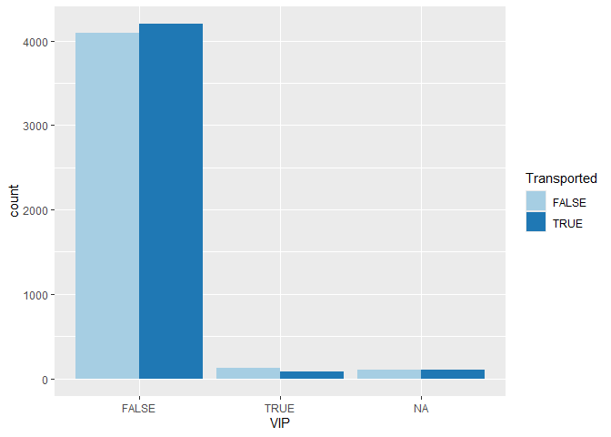

# spaceship-titanic
Nusa Seldi

-   [Introduction](#introduction)
-   [Import Library](#import-library)
-   [Load dataset](#load-dataset)
-   [Check the data](#check-the-data)
-   [Check missing values](#check-missing-values)
-   [Data transformation](#data-transformation)
-   [Explore the data](#explore-the-data)
-   [Build a model](#build-a-model)
-   [Evaluate the model](#evaluate-the-model)
-   [Export dataset for submission](#export-dataset-for-submission)

### Introduction

[Spaceship
Titanic](https://www.kaggle.com/competitions/spaceship-titanic/overview)
is part of kaggle getting started competitions aims to introduce
participants to basic machine learning concepts and facilitate
networking within the Kaggle community. In this competition, our job is
to predict which passengers are transported to an alternate dimension
during the Spaceship Titanic’s collision with the spacetime anomaly. To
assist in this prediction, we are provided with personal records
retrieved from the ship’s damaged computer system.

We will build a classification model to predict which passengers are
transported using Lightgbm. Lets get started!

### Import Library

<details class="code-fold">
<summary>Code</summary>

``` r
library(tidyverse)
library(tidymodels)
library(bonsai)
library(vip)
library(lightgbm)
```

</details>

### Load dataset

<details class="code-fold">
<summary>Code</summary>

``` r
spaceship_train <- read_csv('train.csv')
spaceship_test <- read_csv('test.csv')
```

</details>

### Check the data

<details class="code-fold">
<summary>Code</summary>

``` r
spaceship_train |> head(10)
```

</details>

    # A tibble: 10 × 14
       PassengerId HomePlanet CryoSleep Cabin Destination     Age VIP   RoomService
       <chr>       <chr>      <lgl>     <chr> <chr>         <dbl> <lgl>       <dbl>
     1 0001_01     Europa     FALSE     B/0/P TRAPPIST-1e      39 FALSE           0
     2 0002_01     Earth      FALSE     F/0/S TRAPPIST-1e      24 FALSE         109
     3 0003_01     Europa     FALSE     A/0/S TRAPPIST-1e      58 TRUE           43
     4 0003_02     Europa     FALSE     A/0/S TRAPPIST-1e      33 FALSE           0
     5 0004_01     Earth      FALSE     F/1/S TRAPPIST-1e      16 FALSE         303
     6 0005_01     Earth      FALSE     F/0/P PSO J318.5-22    44 FALSE           0
     7 0006_01     Earth      FALSE     F/2/S TRAPPIST-1e      26 FALSE          42
     8 0006_02     Earth      TRUE      G/0/S TRAPPIST-1e      28 FALSE           0
     9 0007_01     Earth      FALSE     F/3/S TRAPPIST-1e      35 FALSE           0
    10 0008_01     Europa     TRUE      B/1/P 55 Cancri e      14 FALSE           0
    # ℹ 6 more variables: FoodCourt <dbl>, ShoppingMall <dbl>, Spa <dbl>,
    #   VRDeck <dbl>, Name <chr>, Transported <lgl>

<details class="code-fold">
<summary>Code</summary>

``` r
glimpse(spaceship_train)
```

</details>

    Rows: 8,693
    Columns: 14
    $ PassengerId  <chr> "0001_01", "0002_01", "0003_01", "0003_02", "0004_01", "0…
    $ HomePlanet   <chr> "Europa", "Earth", "Europa", "Europa", "Earth", "Earth", …
    $ CryoSleep    <lgl> FALSE, FALSE, FALSE, FALSE, FALSE, FALSE, FALSE, TRUE, FA…
    $ Cabin        <chr> "B/0/P", "F/0/S", "A/0/S", "A/0/S", "F/1/S", "F/0/P", "F/…
    $ Destination  <chr> "TRAPPIST-1e", "TRAPPIST-1e", "TRAPPIST-1e", "TRAPPIST-1e…
    $ Age          <dbl> 39, 24, 58, 33, 16, 44, 26, 28, 35, 14, 34, 45, 32, 48, 2…
    $ VIP          <lgl> FALSE, FALSE, TRUE, FALSE, FALSE, FALSE, FALSE, FALSE, FA…
    $ RoomService  <dbl> 0, 109, 43, 0, 303, 0, 42, 0, 0, 0, 0, 39, 73, 719, 8, 32…
    $ FoodCourt    <dbl> 0, 9, 3576, 1283, 70, 483, 1539, 0, 785, 0, 0, 7295, 0, 1…
    $ ShoppingMall <dbl> 0, 25, 0, 371, 151, 0, 3, 0, 17, 0, NA, 589, 1123, 65, 12…
    $ Spa          <dbl> 0, 549, 6715, 3329, 565, 291, 0, 0, 216, 0, 0, 110, 0, 0,…
    $ VRDeck       <dbl> 0, 44, 49, 193, 2, 0, 0, NA, 0, 0, 0, 124, 113, 24, 7, 0,…
    $ Name         <chr> "Maham Ofracculy", "Juanna Vines", "Altark Susent", "Sola…
    $ Transported  <lgl> FALSE, TRUE, FALSE, FALSE, TRUE, TRUE, TRUE, TRUE, TRUE, …

### Check missing values

<details class="code-fold">
<summary>Code</summary>

``` r
spaceship_train |> summarise_all(~sum(is.na(.))) 
```

</details>

    # A tibble: 1 × 14
      PassengerId HomePlanet CryoSleep Cabin Destination   Age   VIP RoomService
            <int>      <int>     <int> <int>       <int> <int> <int>       <int>
    1           0        201       217   199         182   179   203         181
    # ℹ 6 more variables: FoodCourt <int>, ShoppingMall <int>, Spa <int>,
    #   VRDeck <int>, Name <int>, Transported <int>

<details class="code-fold">
<summary>Code</summary>

``` r
spaceship_test |> summarise_all(~sum(is.na(.)))
```

</details>

    # A tibble: 1 × 13
      PassengerId HomePlanet CryoSleep Cabin Destination   Age   VIP RoomService
            <int>      <int>     <int> <int>       <int> <int> <int>       <int>
    1           0         87        93   100          92    91    93          82
    # ℹ 5 more variables: FoodCourt <int>, ShoppingMall <int>, Spa <int>,
    #   VRDeck <int>, Name <int>

### Data transformation

<details class="code-fold">
<summary>Code</summary>

``` r
spaceship_train <-  spaceship_train |> 
  separate_wider_delim(cols = Cabin, delim = '/', names = c('deck', 'number', 'side')) 

spaceship_test <-  spaceship_test |> 
  separate_wider_delim(cols = Cabin, delim = '/', names = c('deck', 'number', 'side'))  

spaceship_train <-  spaceship_train |> 
  mutate(across(c(HomePlanet, CryoSleep, deck, side, Destination, VIP, Transported), as.factor)) |> 
  mutate(number = as.numeric(number)) |> 
  select(-Name, -PassengerId)

spaceship_test <-  spaceship_test |> 
  mutate(across(c(HomePlanet, CryoSleep, deck, side, Destination, VIP), as.factor)) |> 
  mutate(number = as.numeric(number)) |> 
  select(-Name)

str(spaceship_train)
```

</details>

    tibble [8,693 × 14] (S3: tbl_df/tbl/data.frame)
     $ HomePlanet  : Factor w/ 3 levels "Earth","Europa",..: 2 1 2 2 1 1 1 1 1 2 ...
     $ CryoSleep   : Factor w/ 2 levels "FALSE","TRUE": 1 1 1 1 1 1 1 2 1 2 ...
     $ deck        : Factor w/ 8 levels "A","B","C","D",..: 2 6 1 1 6 6 6 7 6 2 ...
     $ number      : num [1:8693] 0 0 0 0 1 0 2 0 3 1 ...
     $ side        : Factor w/ 2 levels "P","S": 1 2 2 2 2 1 2 2 2 1 ...
     $ Destination : Factor w/ 3 levels "55 Cancri e",..: 3 3 3 3 3 2 3 3 3 1 ...
     $ Age         : num [1:8693] 39 24 58 33 16 44 26 28 35 14 ...
     $ VIP         : Factor w/ 2 levels "FALSE","TRUE": 1 1 2 1 1 1 1 1 1 1 ...
     $ RoomService : num [1:8693] 0 109 43 0 303 0 42 0 0 0 ...
     $ FoodCourt   : num [1:8693] 0 9 3576 1283 70 ...
     $ ShoppingMall: num [1:8693] 0 25 0 371 151 0 3 0 17 0 ...
     $ Spa         : num [1:8693] 0 549 6715 3329 565 ...
     $ VRDeck      : num [1:8693] 0 44 49 193 2 0 0 NA 0 0 ...
     $ Transported : Factor w/ 2 levels "FALSE","TRUE": 1 2 1 1 2 2 2 2 2 2 ...

### Explore the data

<details class="code-fold">
<summary>Code</summary>

``` r
spaceship_train |> 
  drop_na(CryoSleep) |> 
  ggplot(aes(x = CryoSleep, fill = Transported)) +
  geom_bar(position = "dodge") +
  scale_fill_brewer(palette = "Paired") 
```

</details>


<details class="code-fold">
<summary>Code</summary>

``` r
spaceship_train |> 
  ggplot(aes(x = VIP, fill = Transported)) +
  geom_bar(position = "dodge") +
  scale_fill_brewer(palette = "Paired") 
```

</details>



<details class="code-fold">
<summary>Code</summary>

``` r
spaceship_train |> 
  ggplot(aes(x = HomePlanet, fill = Transported)) +
  geom_bar(position = "dodge") +
  scale_fill_brewer(palette = "Paired") 
```

</details>


<details class="code-fold">
<summary>Code</summary>

``` r
spaceship_train |> 
  ggplot(aes(x = Transported,  Age)) +
  geom_boxplot() +
  theme_minimal()
```

</details>


<details class="code-fold">
<summary>Code</summary>

``` r
spaceship_train |> 
  ggplot(aes(x = RoomService, y = FoodCourt, color = Transported)) +
  geom_point(alpha = 0.5) +
  theme_minimal()
```

</details>


<details class="code-fold">
<summary>Code</summary>

``` r
spaceship_train |> 
  ggplot(aes(x = VRDeck, y = Spa, color = Transported)) +
  geom_point(alpha = 0.5) +
  theme_minimal()
```

</details>


### Build a model

<details class="code-fold">
<summary>Code</summary>

``` r
set.seed(789)
spaceship_split <- initial_split(spaceship_train, prop = 0.8, strata = Transported)
train <- training(spaceship_split)
test <- testing(spaceship_split)

set.seed(777)
spaceship_fold <- vfold_cv(train, v = 10, strata = Transported)

spaceship_recipe <- recipe(Transported ~ ., data = train) |> 
  step_impute_knn(CryoSleep) |> 
  step_impute_median(all_numeric_predictors(), -VRDeck, -Spa) |> 
  step_impute_linear(VRDeck, Spa, impute_with = imp_vars(RoomService, FoodCourt, ShoppingMall)) |> 
  step_zv(all_predictors()) 
  
bt_spec <- boost_tree(trees = 200, mtry = tune(), min_n = tune(), tree_depth = tune()) |> 
  set_mode("classification") |> 
  set_engine("lightgbm")

spaceship_wf <- workflow() |> 
  add_recipe(spaceship_recipe) |> 
  add_model(bt_spec)

set.seed(1234)
doParallel::registerDoParallel()
bt_fit <- spaceship_wf |> 
  tune_grid(resamples = spaceship_fold,
            grid = 5,
            control = control_resamples(save_pred = TRUE))
```

</details>

    i Creating pre-processing data to finalize unknown parameter: mtry

### Evaluate the model

<details class="code-fold">
<summary>Code</summary>

``` r
collect_metrics(bt_fit)
```

</details>

    # A tibble: 15 × 9
        mtry min_n tree_depth .metric     .estimator  mean     n std_err .config    
       <int> <int>      <int> <chr>       <chr>      <dbl> <int>   <dbl> <chr>      
     1     6     7         12 accuracy    binary     0.807    10 0.00578 Preprocess…
     2     6     7         12 brier_class binary     0.129    10 0.00335 Preprocess…
     3     6     7         12 roc_auc     binary     0.899    10 0.00445 Preprocess…
     4    12    16          9 accuracy    binary     0.805    10 0.00686 Preprocess…
     5    12    16          9 brier_class binary     0.131    10 0.00382 Preprocess…
     6    12    16          9 roc_auc     binary     0.896    10 0.00493 Preprocess…
     7     3    31          3 accuracy    binary     0.803    10 0.00455 Preprocess…
     8     3    31          3 brier_class binary     0.130    10 0.00256 Preprocess…
     9     3    31          3 roc_auc     binary     0.896    10 0.00390 Preprocess…
    10    10    37          4 accuracy    binary     0.811    10 0.00447 Preprocess…
    11    10    37          4 brier_class binary     0.127    10 0.00308 Preprocess…
    12    10    37          4 roc_auc     binary     0.901    10 0.00439 Preprocess…
    13     5    21         12 accuracy    binary     0.805    10 0.00700 Preprocess…
    14     5    21         12 brier_class binary     0.129    10 0.00336 Preprocess…
    15     5    21         12 roc_auc     binary     0.898    10 0.00445 Preprocess…

<details class="code-fold">
<summary>Code</summary>

``` r
show_best(bt_fit, metric = "roc_auc")
```

</details>

    # A tibble: 5 × 9
       mtry min_n tree_depth .metric .estimator  mean     n std_err .config         
      <int> <int>      <int> <chr>   <chr>      <dbl> <int>   <dbl> <chr>           
    1    10    37          4 roc_auc binary     0.901    10 0.00439 Preprocessor1_M…
    2     6     7         12 roc_auc binary     0.899    10 0.00445 Preprocessor1_M…
    3     5    21         12 roc_auc binary     0.898    10 0.00445 Preprocessor1_M…
    4    12    16          9 roc_auc binary     0.896    10 0.00493 Preprocessor1_M…
    5     3    31          3 roc_auc binary     0.896    10 0.00390 Preprocessor1_M…

<details class="code-fold">
<summary>Code</summary>

``` r
best_tune <- select_best(bt_fit, metric = 'roc_auc')

final_wf <- finalize_workflow(spaceship_wf, best_tune)

spaceship_final <- final_wf |> 
  last_fit(spaceship_split)

collect_metrics(spaceship_final)
```

</details>

    # A tibble: 3 × 4
      .metric     .estimator .estimate .config             
      <chr>       <chr>          <dbl> <chr>               
    1 accuracy    binary         0.816 Preprocessor1_Model1
    2 roc_auc     binary         0.905 Preprocessor1_Model1
    3 brier_class binary         0.124 Preprocessor1_Model1

<details class="code-fold">
<summary>Code</summary>

``` r
results <- collect_predictions(spaceship_final)

results |> 
  conf_mat(truth = Transported, estimate = .pred_class) 
```

</details>

              Truth
    Prediction FALSE TRUE
         FALSE   707  164
         TRUE    156  712

<details class="code-fold">
<summary>Code</summary>

``` r
precision(results, truth = Transported, estimate = .pred_class)
```

</details>

    # A tibble: 1 × 3
      .metric   .estimator .estimate
      <chr>     <chr>          <dbl>
    1 precision binary         0.812

<details class="code-fold">
<summary>Code</summary>

``` r
f_meas(results, truth = Transported, estimate = .pred_class)
```

</details>

    # A tibble: 1 × 3
      .metric .estimator .estimate
      <chr>   <chr>          <dbl>
    1 f_meas  binary         0.815

<details class="code-fold">
<summary>Code</summary>

``` r
spaceship_final |> 
  extract_fit_parsnip() |> 
  vip(num_features = 8, aesthetics = list(fill = "midnightblue"))
```

</details>


<details class="code-fold">
<summary>Code</summary>

``` r
final_wf <- extract_workflow(spaceship_final)

pred <- predict(final_wf, spaceship_test)

pred <-  pred |> 
  mutate(Transported = case_match(.pred_class, "TRUE" ~ "True",
            "FALSE" ~ "False")) |> 
  select(-.pred_class)
pred
```

</details>

    # A tibble: 4,277 × 1
       Transported
       <chr>      
     1 True       
     2 False      
     3 True       
     4 True       
     5 True       
     6 True       
     7 True       
     8 True       
     9 True       
    10 True       
    # ℹ 4,267 more rows

### Export dataset for submission

<details class="code-fold">
<summary>Code</summary>

``` r
submission <- spaceship_test |> 
  select(PassengerId) |> 
  bind_cols(pred) 

submission
```

</details>

    # A tibble: 4,277 × 2
       PassengerId Transported
       <chr>       <chr>      
     1 0013_01     True       
     2 0018_01     False      
     3 0019_01     True       
     4 0021_01     True       
     5 0023_01     True       
     6 0027_01     True       
     7 0029_01     True       
     8 0032_01     True       
     9 0032_02     True       
    10 0033_01     True       
    # ℹ 4,267 more rows

<details class="code-fold">
<summary>Code</summary>

``` r
write_csv(submission, file = 'submission-2.csv')
```

</details>
